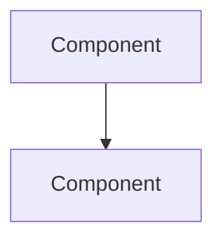

# Architecture Template

The CTO agent must produce exactly two fenced code blocks in this order:

## 1. Architecture JSON

A fenced `json` code block containing a single JSON object with these top-level keys:

```json
{
  "project_name": "string — short project identifier",
  "tech_stack": {
    "language": "string",
    "version": "string",
    "frameworks": ["string"],
    "tools": ["string"]
  },
  "components": [
    {
      "name": "string",
      "responsibility": "string",
      "interfaces": ["string"]
    }
  ],
  "data_models": [
    {
      "name": "string",
      "fields": [
        {"name": "string", "type": "string"}
      ]
    }
  ],
  "api_contracts": [
    {
      "endpoint": "string",
      "method": "string",
      "description": "string"
    }
  ],
  "deployment": {
    "platform": "string",
    "strategy": "string",
    "requirements": ["string"]
  }
}
```

## 2. Architecture Diagram

A fenced `mermaid` code block containing a valid component or flowchart diagram.


