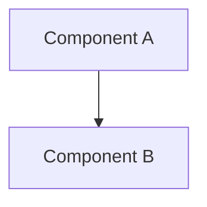

# Product Requirements Document

## Executive Summary

_A concise overview of the product, its purpose, and the problem it solves._

## Goals & Success Metrics

_Measurable goals and the metrics used to evaluate success._

- [ ] Goal 1: _description_ — Metric: _how measured_
- [ ] Goal 2: _description_ — Metric: _how measured_

## Target Users

_Who will use this product and what are their primary needs._

## Functional Requirements

_What the system must do. Number each requirement._

1. _FR-1: description_
2. _FR-2: description_

## Non-Functional Requirements

_Performance, security, scalability, and other quality attributes._

1. _NFR-1: description_
2. _NFR-2: description_

## User Stories

_User stories in standard format._

- As a _[user type]_, I want _[action]_ so that _[benefit]_.

## Acceptance Criteria Checklist

_Every acceptance criterion must be checked off._

- [x] _Criterion 1_
- [x] _Criterion 2_

## System Overview Diagram

_A Mermaid diagram showing the high-level system components._

## Risks & Mitigations

| Risk | Impact | Mitigation |
|------|--------|------------|
| _Risk 1_ | _High/Medium/Low_ | _Mitigation strategy_ |

## Open Questions

_Unresolved questions that need Founder input._

1. _Question 1_
