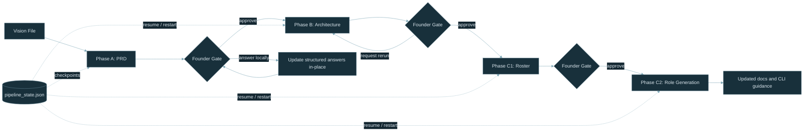

# ASW-CORE-002 Change Log

## Branch Summary

- Expands the pipeline from a two-phase PRD and architecture flow into a resumable multi-phase workflow with Founder-safe question handling and a hiring phase.
- Introduces the `.company/` corporate-memory layout, reusable templates and standards, and generated role prompts for implementation specialists.
- Refreshes end-user documentation for installation, quickstart, CLI behavior, concepts, and pipeline state and recovery.

## Delivery Overview

## Corporate Memory & Hiring Pipeline

### Added

- **`.company/` operating model expansion** — the workspace now carries `memory/`, `templates/`, and `standards/` directories alongside roles and artifacts, giving agents editable local context instead of relying on hidden state.
- **Bundled standards and templates** — Python and UI standards plus PRD, architecture, and role templates are copied into the working company so the Founder can refine them between runs.
- **Hiring pipeline roles** — `hiring_manager.md` and `role_writer.md` add a new roster-planning phase and per-role prompt generation after architecture approval.
- **Roster artifacts** — `roster.json` and `roster.md` are generated and mechanically linted before Founder approval.
- **Generated implementation roles** — approved roster entries are transformed into concrete specialist role files under `.company/roles/`.

### Changed

- `init_company()` now migrates legacy `.company/state/` directories into `.company/memory/` so older runs remain usable.
- `run_pipeline()` now extends past architecture approval into roster planning and role generation, preserving architecture outputs as upstream context.
- `Agent.run()` now supports appended standards content so organizational rules are injected consistently at the system-prompt layer.
- Architecture rendering and downstream artifact handling were tightened so generated markdown stays aligned with the machine-readable artifacts that drive later phases.

### Tests

- `test_hiring.py` covers roster linting, roster rendering, role linting, standards assignment, and role-generation flows.
- `test_orchestrator.py` covers the end-to-end hiring phase sequencing and artifact persistence behaviors.

## Founder Question Flow & Retry Safety

### Added

- **Structured Founder review results** — the Founder Gate now distinguishes between approving, rejecting, modifying, answering structured questions locally, and explicitly requesting another question round.
- **Local founder-answer incorporation** — PRD, architecture, and roster artifacts now store selected founder answers directly in their structured question data instead of immediately rerunning Gemini.
- **Founder answer rendering** — architecture and roster markdown artifacts now display captured founder answers so the Founder can review resolved decisions before approving.
- **Artifact-aware reruns** — when the Founder explicitly requests another question round or broader revisions, the current artifact and captured founder answers are added to the next agent context.
- **Transient Gemini error classes** — backend invocation failures are now classified as retryable or non-retryable with explicit reasons.

### Changed

- `founder_review()` in `gates.py` no longer treats answered questions as generic modify feedback.
- `_run_prd_phase()`, `_run_architecture_phase()`, and `_run_roster_phase()` in `orchestrator.py` now update founder answers locally and only rerun agents on explicit Founder actions.
- `_agent_loop()` now retries only transient Gemini failures. Mechanical validation failures and non-transient CLI failures fail fast to avoid burning extra tokens.
- `cpo.md`, `cto.md`, and `hiring_manager.md` now instruct agents to revise current artifacts and not re-ask already answered founder questions.
- `scripts/test_company.sh` now uses `--restart` so manual live runs rebuild `.company/` from the latest bundled roles and templates.

### Tests

- `test_gates.py` now covers structured Founder actions and explicit question-round requests.
- `test_questions.py` now covers answered-question filtering and local PRD answer incorporation.
- `test_orchestrator.py` now covers log-derived founder loop regressions, local-answer flow across phases, artifact-aware reruns, and fail-fast retry behavior.
- `test_gemini.py` now covers timeout, service-unavailable, and non-transient Gemini CLI failure classification.

## Pipeline Resume & Restart

### Added

- **`pipeline_state.json`** — checkpoint file written to `.company/` after each phase. Tracks pipeline version, vision file SHA-256 hash, and completed phases with timestamps.
- **Resume-by-default** — `run_pipeline()` reads existing state and skips phases that are already completed (both recorded in state AND artifacts exist on disk). Existing artifacts are loaded from disk to provide context for downstream phases.
- **Vision change detection** — SHA-256 hash of the vision file is stored in state. On re-invocation, if the hash differs, the user is prompted to **[C]ontinue** from where they left off or **[R]estart** from scratch.
- **`--restart` CLI flag** — deletes the entire `.company/` directory before the pipeline begins, forcing a clean slate.
- **State functions in `company.py`**:
  - `hash_file(path)` — SHA-256 hex digest of a file.
  - `read_pipeline_state(workdir)` — read and parse state file; returns `None` if missing or corrupt.
  - `write_pipeline_state(workdir, state)` — persist state dict to disk.
  - `mark_phase_complete(workdir, state, phase)` — record a phase as completed with timestamp.
  - `clear_company(workdir)` — delete the `.company/` directory.
- **`_is_phase_done()` in `orchestrator.py`** — checks both state and artifact file existence; a missing artifact triggers re-run even if state says completed.

### Changed

- `run_pipeline()` — accepts new `restart` keyword argument; orchestration flow now wraps each phase in a skip-or-run check.
- `write_pipeline_state()` now performs temp-file replacement, and git commits are tracked as separate completion markers so failed commits retry on rerun without forcing a fresh LLM phase.
- `build_parser()` in `cli/main.py` — added `--restart` argument to the `start` subcommand.

### Tests

- `test_company.py` — 8 new tests for `hash_file`, `read_pipeline_state`, `write_pipeline_state`, `mark_phase_complete`, `clear_company`.
- `test_orchestrator.py` — 8 new tests: `_is_phase_done` unit tests, resume skipping, missing-artifact re-run, `--restart` flag, vision-changed continue/restart flows.

## Documentation & Validation

### Changed

- User documentation was rewritten across installation, quickstart, CLI reference, concepts, runs-and-state, and the first-project tutorial to reflect the current Founder workflow and recovery model.
- CLI help output now includes clearer command-specific guidance and better coverage of the `start` command flags.
- `scripts/lint-python.sh` now resolves `pylint` and `mypy` through the repository `.venv` when present so `check-all.sh` runs against the same environment as `pytest`.

### Tests

- `test_cli.py` adds coverage for help output parsing and command guidance regressions.
- `test_logging.py` validates the logging-path behavior that supports the more explicit CLI and recovery flow.
