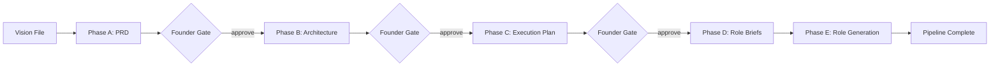

# ASW-CORE-003 Change Log

## Branch Summary

- Adds a new VP Engineering phase between architecture and hiring.
- Moves team selection authority to the VP Engineering, with Founder approval at the execution-plan gate.
- Repurposes the Hiring Manager from team selection to automatic role-brief elaboration for the approved team.
- Preserves Role Writer as the final prompt-generation step and updates user documentation for the new five-phase flow.

## Delivery Overview

## Execution Planning

### Added

- `src/asw/roles/vpe.md` for the new VP Engineering agent prompt.
- `src/asw/templates/execution_plan_template.md` as a bundled reference template.
- `execution_plan.json` and `execution_plan.md` artifacts in `.company/artifacts/`.
- `validate_execution_plan()` in `src/asw/linters/json_lint.py` for structured execution-plan validation.
- Execution-plan rendering, writing, founder-review handling, skip/resume support, and commit tracking in `src/asw/orchestrator.py`.

### Changed

- `run_pipeline()` now executes: PRD -> Architecture -> Execution Plan -> Role Briefs -> Role Generation.
- The Founder review gate for planning now happens on the VP Engineering output instead of the Hiring Manager output.
- Resume semantics now treat `execution_plan.json` and `execution_plan.md` as required artifacts for the new phase.
- Git commit boundaries now include `[asw] Phase: execution-plan-generation completed`.

## Hiring Flow

### Changed

- `src/asw/roles/hiring_manager.md` now elaborates the approved team into structured role briefs instead of selecting the team.
- `roster.json` remains the downstream machine-readable artifact, but now represents approved-team role briefs with mission, scope, deliverables, collaborators, and standards.
- `src/asw/roles/role_writer.md` and role-generation context now include the execution plan and the richer Hiring Manager role brief.

## Tests

### Added

- `tests/test_execution_plan.py` for execution-plan validation and Markdown rendering.

### Changed

- `tests/test_orchestrator.py` now covers the inserted VP Engineering phase, its founder-review behavior, updated commit flow, and the new five-call mocked pipeline.
- `tests/test_hiring.py` now validates the richer role-brief schema.
- `tests/test_company.py` now checks that bundled VPE and execution-plan template assets are copied into `.company/`.

## Documentation

### Changed

- Updated user docs across concepts, runs-and-state, CLI reference, quickstart, tutorial, and the user docs index to describe the execution-plan phase and the revised hiring responsibilities.
