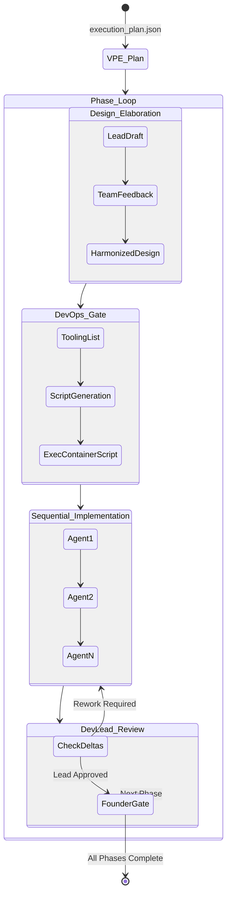

# Phase V0.4: The Phase & Development Loop

## 1. Objective

Transition the organization from planning (V0.1 - V0.3) into execution. This phase implements the **Phase Loop**, which iterates through the VP of Engineering's execution plan. It introduces the mandatory recruitment of the DevOps Engineer and Development Lead, and enforces a strict sequence of design elaboration, environment provisioning, sequential implementation, and review.

## 2. Mandatory Role Injection (Hiring Update)

The `Hiring Manager` agent's mechanical linting (`_lint_roster`) must be updated to enforce the presence of two immutable core roles in every project, regardless of the CTO's architecture.

* **`devops_engineer.md`**: Responsible for DevContainer tool installation, persistent maintenance, and secure framework implementations.
* **`development_lead.md`**: Responsible for sub-task allocation, inter-role coordination, and delta-reviews against phase designs.

**Mechanical Change:**
The `_lint_roster` function must now fail the Hiring Manager if the output JSON does not contain entries for both `"DevOps Engineer"` and `"Development Lead"`.

## 3. The Phase Loop Architecture

Once the VPE outputs the `execution_plan.json` (containing an array of phases), the orchestrator enters the Phase Loop. Each iteration of this loop corresponds to a single phase from the VPE's plan and consists of four sub-phases.

### Sub-Phase 1: Design Elaboration (The Planning Room)

This is strictly a design phase, ensuring all assigned agents understand their inputs and outputs before writing code.

* **Step A (Lead Elaboration):** The Development Lead reads the VPE's current phase plan, combined with the CTO/CPO vision artifacts. They output a `phase_{N}_design_draft.md`.
* **Step B (Team Feedback):** Every agent listed in the roster is prompted with the draft. They output a localized markdown feedback block detailing their specific tasks and framework needs.
* **Step C (Harmonization):** The Development Lead ingests all feedback and generates a final `phase_{N}_design_final.md`.
* **Mechanical Linting (`_lint_phase_design`):** * Must contain a fenced JSON block mapping specific tasks to specific agents.
  * Must contain a `## Required Tooling` markdown list.

### Sub-Phase 2: Environment Prep (The DevOps Gate)

Before implementation begins, the DevContainer environment must be primed with the necessary tools identified in the design.

* **Agent Execution:** The DevOps Engineer reads the `## Required Tooling` section of `phase_{N}_design_final.md`.
* **Output:** Generates a Bash script `.devcontainer/phase_{N}_setup.sh` and a summary of environment changes.
* **Mechanical Execution:** The orchestrator physically runs `bash .devcontainer/phase_{N}_setup.sh` inside the container.
* **Fallback:** If the script fails (non-zero exit code), the error logs are fed back to the DevOps Engineer for a retry (up to 3 attempts).

### Sub-Phase 3: Sequential Implementation

Agents execute their assigned work blocks from the harmonized design.

* **Sequential Execution:** The orchestrator iterates through the task list generated in Sub-Phase 1. Agents run sequentially, not in parallel.
* **Shared State:** Because execution is sequential, Agent B has full read access to the `.company/memory/` and `src/` changes just committed by Agent A.
* **Artifact:** Each agent outputs their code modifications alongside a `task_{id}_completion.md` log detailing what was changed.

### Sub-Phase 4: Dev Lead Review (The Delta Loop)

The Development Lead acts as an internal, automated gatekeeper before presenting the phase to the Founder.

* **Review Agent:** The Development Lead reviews the `src/` directory diffs and task completion logs against `phase_{N}_design_final.md`.
* **Output:** Yields a `phase_{N}_review.json` containing a boolean `{"approved": true/false}` and an array of `{"deltas": []}`.
* **Delta Rework:** If `approved` is false, the orchestrator loops back to Sub-Phase 3, feeding the deltas back to the responsible agents for correction.
* **Founder Gate:** Once the Development Lead approves, the orchestrator triggers the **Founder Review Gate**, pausing the terminal.
  * *Approve:* Git commit `[asw] Phase {N} complete`, write state to `pipeline_state.json`, and loop to the next VPE phase.
  * *Reject/Modify:* Re-trigger the Delta Loop with Founder instructions.

## 4. Pipeline State & Artifact Updates

The `.company/` file system database expands to support the loop:

```text
.company/
├── artifacts/
│   ├── execution_plan.json         ← From VPE
│   └── phases/                     ← NEW: Directory for phase tracking
│       ├── 01_design_final.md      ← Harmonized design
│       ├── 01_review.json          ← Dev Lead approval state
│       └── ...
```

The `pipeline_state.json` schema must be updated to track sub-phase progress so that if the DevContainer halts during sequential implementation, it resumes exactly on the pending agent task without repeating completed work blocks.

## 5. System Diagram (Mermaid)


