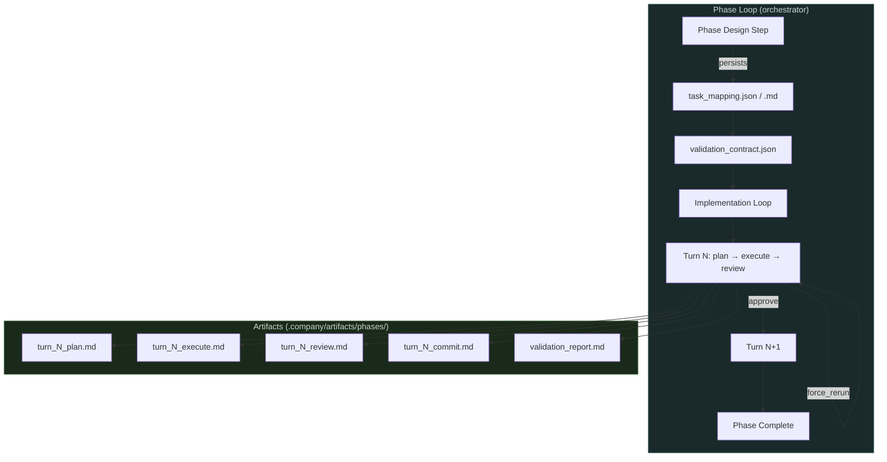

# CHANGELOG: ASW-CORE-005

## Summary

This branch delivers **Slices 3–5** of the phase-loop pipeline: task-owner-driven phase planning, a validation contract subsystem, a full phase implementation loop, and Development Lead review gating. The branch also wires a `force_rerun` capability for resuming failed implementation turns and adds comprehensive test coverage throughout.

---

## New Modules

### `src/asw/phase_tasks.py`

Task-mapping helpers that make approved phase work durable and reusable.

- `lint_phase_task_mapping_json` — validates the task-mapping JSON block from a phase design, checks for dependency cycles, and ensures all owners are in the roster.
- `ordered_phase_tasks` — returns tasks in stable topological dependency order.
- `tasks_owned_by` — filters the ordered task list to a single owner.
- `render_phase_task_mapping_markdown` — produces the readable companion `.md` from the canonical JSON.
- `write_phase_task_mapping` / `load_phase_task_mapping` — persist and reload the two derived artifacts.

### `src/asw/validation_contract.py`

Validation contract management for the phase pipeline.

- `new_validation_contract` — bootstraps a contract with known gaps and no validations.
- `validate_validation_contract` — mechanical schema validation (supported `kind` values, required fields).
- `ensure_validation_contract` — creates a contract artifact if none exists yet.
- `render_validation_contract_markdown` — human-readable companion document.
- `write_validation_contract` / `load_validation_contract` — persist and reload the JSON artifact.

### `src/asw/validation_runner.py`

Executes a validation contract against the workspace.

- `run_validation_contract` — runs each enabled `command` check in the contract's workspace directory; marks `manual` and `checklist` entries as pending.
- `ValidationCheckResult` / `ValidationRunReport` — frozen dataclasses capturing per-check and aggregate results.
- `render_validation_report_markdown` — produces a Markdown summary with per-check status.

### `src/asw/phase_implementation.py`

Orchestration helpers for running individual implementation turns.

- `PhaseImplementationTurn` — typed data for one scheduled turn (owner, tasks, index).
- `next_phase_implementation_turn` — selects the next unstarted turn respecting dependency order.
- `build_implementation_plan_request` / `build_implementation_execute_request` — assemble the LLM prompt context for plan and execute steps.
- `build_development_lead_review_request` — strict Development Lead review prompt.
- `lint_development_lead_review_json` — validates and normalises the review response JSON.
- `render_phase_implementation_turn_summary` — Markdown summary of one turn's scope.

---

## Extended Modules

### `src/asw/orchestrator.py` (+1246 lines)

- **Phase preparation** now persists the approved task-mapping JSON and Markdown artifacts after each final phase design step.
- **Validation contract** is included in the Development Lead's phase-design context so deliverables and acceptance criteria reflect required validations.
- **Phase implementation loop** (`_run_phase_implementation_loop`) drives multi-turn execution:
  - Three-step turns: plan → execute → Development Lead review.
  - Resume logic (`_classify_implementation_turn_resume`) covers approved, revise, force-rerun, and pending-validation states.
  - Commit gating validates changed file scope against the approved turn plan.
  - `force_rerun` flag allows re-running the current turn without replaying previous steps.
- New helper functions: `_invoke_agent_execute_with_progress`, `_run_development_lead_review`, `_commit_implementation_turn`, `_classify_implementation_turn_resume`, `_run_phase_implementation_turn`, and more.

### `src/asw/agents/base.py`

- Added `mode`, `feedback`, `plan`, and `auto_approve` parameters to `_invoke` to support the three-step implementation turn flow.
- Updated `_build_user_prompt` to omit blank sections.

### `src/asw/llm/gemini.py` + `src/asw/llm/backend.py`

- `GeminiBackend` now forwards `mode`, `plan`, `feedback`, and `auto_approve` to the Gemini CLI invocation.
- `plan`/`execute` mode preambles injected into the CLI prompt.

### `src/asw/phase_preparation.py`

- `build_phase_artifact_paths` now includes `task_mapping_json_path` and `task_mapping_md_path`.
- `_run_phase_design_step` persists the approved task mapping after the final design passes linting.
- `find_tracked_file_mutations` added for detecting hash changes in tracked inputs.

### `src/asw/git.py`

- `commit_files` now accepts an `extra_paths` argument for including derived artifacts in the same commit.
- `changed_files_since_commit` and `repo_relative_path` helpers added.

### `src/asw/linters/json_lint.py`

- `_expect_string_list` helper added for validating typed list fields in JSON schemas.

---

## Tests

| Test file | Coverage added |
|---|---|
| `test_phase_tasks.py` | Lint, ordering, ownership filtering, Markdown render, round-trip I/O |
| `test_validation_contract.py` | Bootstrap, schema validation, Markdown render, round-trip I/O |
| `test_validation_runner.py` | Command execution, failure marking, pending-manual marking, report render |
| `test_phase_implementation.py` | Ready-task filtering, batch scheduling, dependency unlocking, Dev Lead review lint |
| `test_orchestrator.py` | Full implementation loop, turn persistence, force-rerun, validation contract invalidation, downstream turn re-scheduling |
| `test_gemini.py` | Mode/plan/execute prompt injection |
| `test_git.py` | `changed_files_since_commit`, `repo_relative_path`, `extra_paths` in commit |
| `test_logging.py` | Debug log signal-to-noise (no LLM chatter at INFO level) |

---

## Architecture Diagram

---

## Code Quality

- All 178 tests pass.
- `check-all.sh` exits clean: Markdown lint ✓, Python format ✓, pylint 10.00/10 ✓, ruff ✓, mypy ✓.
