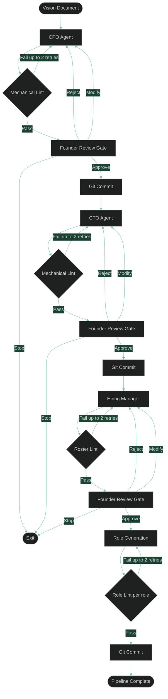

# Key Concepts

A quick reference for the ideas that underpin how `asw` works.

## The Pipeline

When you run `asw start`, it executes a fixed sequence of phases called the **V0.2 Pipeline**. Each phase is owned by an agent, produces an artifact, and must pass a Founder Review Gate before the pipeline advances.



### Phase A — PRD

The **CPO agent** reads your vision document and produces a **Product Requirements Document** in Markdown. The PRD must contain all of the following sections:

- Executive Summary
- Goals & Success Metrics
- Target Users
- Functional Requirements
- Non-Functional Requirements
- User Stories
- Acceptance Criteria Checklist
- System Overview Diagram
- Risks & Mitigations
- Open Questions

If an agent includes structured `founder_questions`, the Founder Gate captures those answers **locally** in the artifact first. Answering questions does **not** automatically trigger another LLM call. After the artifact is updated, the Founder can review the updated draft, approve it, modify it, reject it, or explicitly request another question round.

### Phase B — Architecture

The **CTO agent** reads the vision and the approved PRD, then produces a **system architecture** containing:

- An `architecture.json` file describing the tech stack, components, data models, API contracts, and deployment strategy.
- An `architecture.md` file with a Mermaid component diagram.

### Phase C1 — Roster Planning

The **Hiring Manager agent** reads the approved `architecture.json` and the list of available standards files, then proposes a **roster** of specialist roles needed to implement the architecture.

- A `roster.json` file containing role metadata (title, filename, responsibility, assigned standards).
- A `roster.md` file with a human-readable table for Founder review.

The Founder Gate for the roster supports **Modify** to directly edit the role list — add, remove, or rename roles before approving.

The same local-answer flow applies to any phase that emits `founder_questions`: selected choices are converted into explicit answers and written back into the artifact so the Founder can review the resolved decisions before asking the agents to run again.

### Phase C2 — Role Generation

After the roster is approved, the **Role Writer agent** generates a Markdown system prompt for each role — one LLM call per role. Generated role files are written to `.company/roles/`. This phase runs **automatically** with no Founder Gate.

---

## Agents and Roles

Each agent is a specialised LLM session guided by a **role file** — a Markdown document that defines the agent's persona, output format, and strict rules.

Role files live in `.company/roles/` and are copied there from the package defaults when you first run `asw start`. You can edit them between runs to change agent behaviour.

| Agent | Role File | Artifact Produced |
|-------|-----------|-------------------|
| CPO | `.company/roles/cpo.md` | `.company/artifacts/prd.md` |
| CTO | `.company/roles/cto.md` | `.company/artifacts/architecture.json` + `architecture.md` |
| Hiring Manager | `.company/roles/hiring_manager.md` | `.company/artifacts/roster.json` + `roster.md` |
| Role Writer | `.company/roles/role_writer.md` | `.company/roles/<generated>.md` (one per role) |

### Standards Injection

Agents can have **organisational standards** injected into their system prompts. Standards files live in `.company/standards/` and are appended to the role file when the agent runs. The Hiring Manager decides which standards apply to each generated role via the `assigned_standards` field in the roster.

---

## Mechanical Linting

Before an agent's output reaches the Founder Review Gate, `asw` runs **mechanical linters** to verify structural correctness. If linting fails, the pipeline exits immediately instead of automatically resending the same prompt. This avoids spending extra tokens on responses that were already delivered but structurally invalid.

Automatic retries are reserved for **transient Gemini CLI failures** only, such as timeouts, connection interruptions, rate limits, and explicit busy or service-unavailable responses. Those retry reasons are logged explicitly in the debug log.

Linting checks include:

- All required Markdown sections are present (PRD phases).
- The Acceptance Criteria Checklist uses `- [x]` items.
- A valid fenced Mermaid code block is present.
- The architecture JSON block is present and parses correctly.

---

## Founder Review Gate

At every major phase boundary the pipeline **pauses** and presents the artifact for your review. This is called the **Founder Review Gate**.

```text
========================================================================
  FOUNDER REVIEW GATE  –  Phase: PRD
========================================================================
[A]pprove  [R]eject  [M]odify  [S]top  >
```

| Choice | Behaviour |
|--------|-----------|
| **A** — Approve | Accept the artifact, commit to git, advance the pipeline |
| **R** — Reject | Discard the artifact; agent starts over with the original context |
| **M** — Modify | You type multi-line feedback; agent retries with your notes included |
| **S** — Stop | Pipeline exits cleanly with code `0`; all prior commits are preserved |

When you choose **M**, type your feedback line by line and press **Enter on a blank line** to finish.

---

## The `.company/` Directory

`asw` keeps all shared state in a `.company/` directory inside your working directory. It is created automatically on first run.

```text
.company/
  roles/        ← Agent system prompts (bundled + generated, editable)
  artifacts/    ← Documents produced by agents
  memory/       ← Living documents generated by the workflow
  templates/    ← Reusable Markdown structures (editable)
  standards/    ← Organisational rules injected into agent prompts (editable)
```

This directory is committed to git at the end of each successful phase, giving you a full history of every artifact.

---

## The Git State Machine

`asw` automatically stages and commits `.company/` (and `src/` if it exists) after each approved phase. Commit messages follow this pattern:

```text
[asw] Phase: prd-generation completed
[asw] Phase: architecture-generation completed
[asw] Phase: hiring completed
```

Your working directory must be inside a git repository before you start. If there is nothing new to commit (e.g. the agent produced identical output on a retry), `asw` skips the commit silently.

### Skipping Commits

Pass `--no-commit` to disable all git operations for a run:

```bash
asw start --vision vision.md --no-commit
```

This is useful when you want to explore agent output before deciding whether to track it, or when running `asw` outside a git repository for quick experiments. The git-repo check is also skipped when `--no-commit` is set.

---

## LLM Backend

`asw` currently supports a single backend: the **Google Gemini CLI** (`gemini`). It must be installed and on `$PATH`.

```bash
npm install -g @google/gemini-cli
```

The backend is selected internally — there is no user-facing flag to change it in V0.2.

---

## See Also

- [CLI Reference](cli.md) — all commands and flags
- [Quickstart](../getting-started/quickstart.md) — a first-run walkthrough
- [First Project Tutorial](../tutorials/first-project.md) — end-to-end guided example
