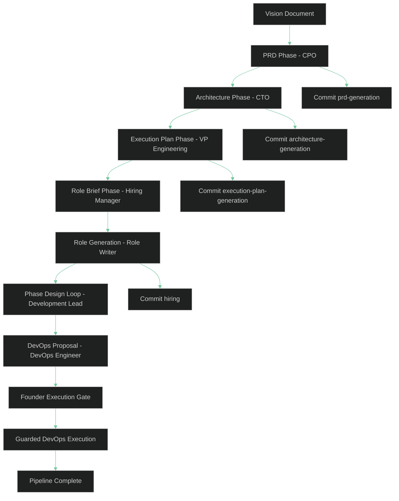
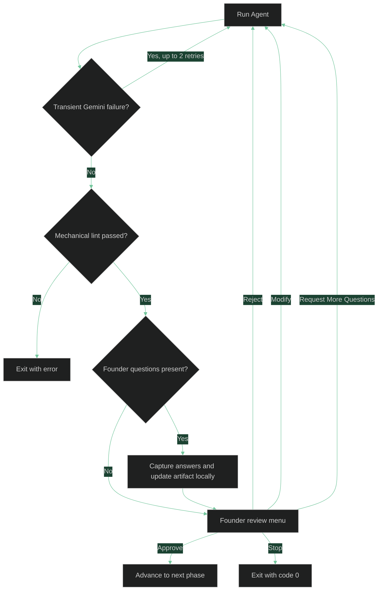

# Key Concepts

This page explains the core ideas behind the V0.3 workflow so you can predict what `asw` will do before you run it.

## The V0.3 Pipeline

`asw start` runs a fixed sequence of phases. Each phase is owned by one agent, produces one or more artifacts, and pauses for Founder review whenever the system is about to lock in an important planning decision or run the first mutating environment-prep step.



### Phase A - PRD

The CPO turns the vision document into `prd.md`. The PRD must include required sections such as goals, user stories, acceptance criteria, a system overview diagram, risks, and open questions.

### Phase B - Architecture

The CTO reads the vision and approved PRD, then produces:

- `architecture.json` for the machine-readable system specification.
- `architecture.md` for the human-readable summary and Mermaid diagram.

### Phase C - Execution Plan

The VP Engineering reads the vision, approved PRD, and approved architecture, then produces:

- `execution_plan.json` for the machine-readable phased delivery plan and Phase 1 team selection.
- `execution_plan.md` for the human-readable summary and Founder review artifact.

This is the phase where the Founder approves the initial hiring plan. The VP Engineering decides what must be built now, what can be deferred, and which roles are justified for the first phase.

### Phase D - Role Briefs

The Hiring Manager reads `architecture.json`, `execution_plan.json`, and the available standards files, then elaborates the approved team into:

- `roster.json` with role-brief metadata.
- `roster.md` with a human-readable summary of those operating briefs.

This phase runs automatically with no Founder gate. The Hiring Manager does not choose who to hire; that decision was already made by the VP Engineering and approved by the Founder.

### Phase E - Role Generation

After the role briefs are generated, the Role Writer generates one Markdown role prompt per approved roster entry. These files are written into `.company/roles/` and no extra Founder gate runs for this phase.

### Phase F - Phase Design Loop

After hiring artifacts are complete, `asw` iterates through the approved `execution_plan.json` phases.

For each phase, the Development Lead:

- Produces a draft phase design.
- Collects one feedback artifact per assigned role.
- Harmonizes the feedback into a final phase design.

The final phase design must include a fenced JSON task mapping plus a `## Required Tooling` list. These artifacts live under `.company/artifacts/phases/`.

### Phase G - Guarded DevOps Setup

Once a final phase design exists, the DevOps Engineer generates a setup proposal and an extracted `.devcontainer/phase_{N}_setup.sh` script for that phase.

This is intentionally split into two parts:

- **Proposal generation** is still planning work.
- **Script execution** is the first mutating step in the self-hosted ASW repository and is therefore blocked behind a hard Founder gate.

The Founder reviews the exact proposal and script path before anything runs. If the Founder asks for changes, `asw` regenerates the proposal and requires approval again. If the script changes, old approval does not carry forward.

After approval, `asw` runs the script with extra safety checks. It records the execution log and compares tracked repo files before and after the run. If tracked files changed outside the approved artifact boundary, the sub-phase fails instead of silently continuing.

## How A Single Phase Runs

All reviewable phases share the same execution pattern.



Two details matter here:

- Only transient Gemini failures are retried automatically.
- Structural lint failures do not trigger an automatic rerun.

## Founder Questions And Review Gates

Agents may include structured `founder_questions` in their output. When that happens, `asw` asks you those questions first and applies the answers locally inside the artifact.

That means answering questions does **not** automatically spend another LLM call. You get to inspect the updated artifact before deciding what to do next.

When pending founder questions exist, the Founder Review panel hides the raw structured question payload and the pending-question prose that would otherwise duplicate the CLI prompts. You answer the questions in the CLI first, then review the updated artifact.

The review menu supports these actions:

| Choice | Behavior |
|--------|----------|
| Approve | Accept the artifact and continue |
| Reject | Discard the current draft and rerun the phase from its original context |
| Modify | Provide multiline feedback and rerun with those notes included |
| Request More Questions | Ask for another question round focused on unresolved issues |
| Stop | Exit cleanly with code `0` |

For the execution-plan phase, **Modify** has an extra shortcut: if you paste a JSON object directly, `asw` validates it and uses that edited plan without calling the VP Engineering again.

## Agents, Roles, And Standards

Each agent is driven by a role file in `.company/roles/`. On the first run, `asw` copies the bundled defaults into your workspace so you can edit them later.

| Agent | Role File | Primary Output |
|-------|-----------|----------------|
| CPO | `.company/roles/cpo.md` | `.company/artifacts/prd.md` |
| CTO | `.company/roles/cto.md` | `.company/artifacts/architecture.json` and `architecture.md` |
| VP Engineering | `.company/roles/vpe.md` | `.company/artifacts/execution_plan.json` and `execution_plan.md` |
| Hiring Manager | `.company/roles/hiring_manager.md` | `.company/artifacts/roster.json` and `roster.md` |
| Role Writer | `.company/roles/role_writer.md` | Generated role prompts in `.company/roles/` |
| Development Lead | `.company/roles/development_lead.md` | Phase design draft and final artifacts in `.company/artifacts/phases/` |
| Phase Feedback Reviewer | `.company/roles/phase_feedback_reviewer.md` | Per-role planning feedback in `.company/artifacts/phases/` |
| DevOps Engineer | `.company/roles/devops_engineer.md` | Setup proposal, summary, and extracted setup script |

Standards files live in `.company/standards/`. The Hiring Manager assigns
standards while elaborating each approved role brief, and the Role Writer
incorporates those standards into the generated prompt.

On the first run, `asw` also copies bundled templates into `.company/templates/`.

The current V0.3 pipeline actively reads:

- `execution_plan_template.md`, which the VP Engineering uses as structural
  guidance when generating `execution_plan.json`.
- `role_template.md`, which the Role Writer uses as the outline for each
  generated specialist role prompt.

`prd_template.md` and `architecture_template.md` are bundled too, but the
current pipeline does not read them directly during generation.

## Mechanical Linting And Retries

Before a phase reaches the Founder Review Gate, `asw` validates the artifact mechanically.

Examples of lint checks:

- PRDs must contain the required Markdown sections.
- Acceptance criteria must use completed checklist items like `- [x]`.
- Mermaid code blocks must be present where required.
- Architecture output must contain valid JSON and Mermaid blocks.
- Execution-plan output must be valid JSON with phases, selected team entries, and deferred work.
- Roster output must be valid JSON with `hired_agents` role-brief entries.
- Generated role files must include the required sections and minimum structure.
- Phase designs must contain a valid JSON task mapping and a `## Required Tooling` list.
- DevOps setup proposals must contain the required sections plus a guarded bash script that passes safety linting.

If linting fails, `asw` exits. This is intentional: the invalid output already exists, so resubmitting the same run automatically would burn more tokens without any Founder intervention.

Before exiting, `asw` saves the rejected output and validation errors under `.company/artifacts/failed/` so you can inspect the bad artifact without relying on debug logs alone.

Automatic retries are reserved for transient Gemini problems such as timeouts, rate limits, busy responses, or temporary service failures.

## The `.company/` Directory

`asw` stores shared state in `.company/` inside your working directory.

```text
.company/
  pipeline_state.json
  roles/
  artifacts/
  memory/
  templates/
  standards/
```

What each part does:

- `pipeline_state.json` stores a tracked-file hash catalog plus per-phase input and output snapshots used for resume behavior.
- `roles/` contains bundled role files plus generated specialist roles.
- `artifacts/` contains PRD, architecture, roster, phase-design, setup-proposal, and other generated documents.
- `memory/` is reserved for workflow memory documents.
- `templates/` contains bundled templates, including the live
  `execution_plan_template.md` and `role_template.md` inputs.
- `standards/` contains organization-wide rules injected into role prompts.

If you have an older `.company/state/` directory from earlier runs, `asw` migrates it to `.company/memory/` automatically.

## Git Commits

When commits are enabled, `asw` stages `.company/` by default. If you pass `--stage-all`, it stages the full git worktree before creating the phase commit. Successful runs typically create these commits:

```text
[asw] Phase: prd-generation completed
[asw] Phase: architecture-generation completed
[asw] Phase: execution-plan-generation completed
[asw] Phase: hiring completed
```

If there is nothing new to commit for a phase, `asw` prints a message and continues.

Pass `--no-commit` to skip all git operations and the git-repository requirement.

Pass `--stage-all` when you explicitly want the phase commits to include changes outside `.company/`.

## Resume, Restart, And Debug Logs

Rerunning `asw start` usually resumes from saved state rather than starting over.

- PRD, architecture, execution plan, roster, role generation, phase design, and DevOps proposal steps are skipped only when their saved input and output hashes still match the current tracked files.
- Changes to the vision, bundled role files, templates, standards, or saved artifacts can invalidate the earliest affected completed phase.
- DevOps execution does not auto-reuse stale approval. If the saved proposal or generated script changed, the Founder must approve execution again.
- When tracked inputs changed but the saved outputs still exist, `asw` lets you continue with the saved artifacts, rerun from that phase, or restart from scratch.
- `--restart` forces a clean rebuild of `.company/`.
- `--debug` writes detailed logs to a file for troubleshooting. If you pass a custom log path, `asw` creates missing parent directories automatically.

See [Runs, State, and Recovery](runs-and-state.md) for the full behavior.

## LLM Backend

`asw` currently supports one backend: the Google Gemini CLI. There is no user-facing flag to switch backends in V0.3.

## See Also

- [CLI Reference](cli.md) - all commands and flags
- [Runs, State, and Recovery](runs-and-state.md) - resume, restart, and debug behavior
- [Quickstart](../getting-started/quickstart.md) - a practical first run
