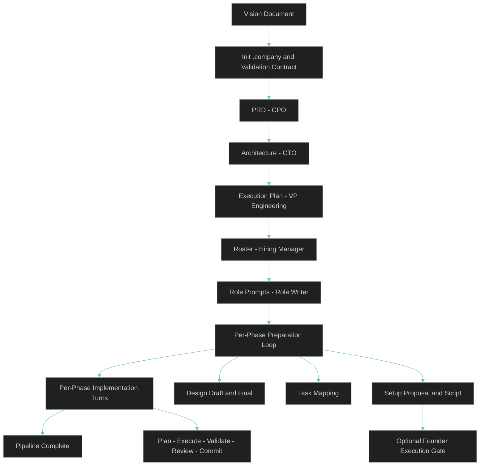
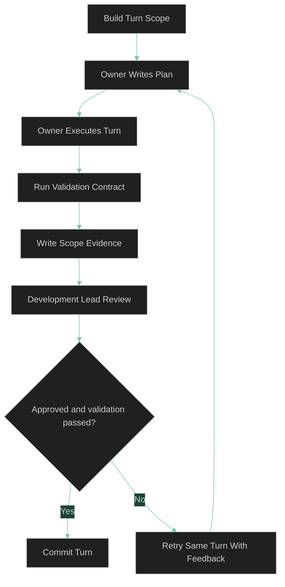

# Key Concepts

This page explains the current workflow so you can predict what `asw` will do before you run it.

## The Pipeline At A Glance

`asw start` runs a fixed planning sequence first, then iterates through phase preparation and implementation.



At startup, `asw` also bootstraps `.company/artifacts/validation_contract.json` and `.company/artifacts/validation_contract.md`.

## The Three Founder Planning Gates

The normal founder-review flow happens at three points:

1. PRD
2. Architecture
3. Execution Plan

These gates all support the same menu:

- `Approve`
- `Reject`
- `Modify`
- `Request More Questions`
- `Stop`

If an artifact contains structured founder questions, `asw` asks those questions first, writes the answers back into the artifact locally, and then returns you to the review menu.

One important boundary change on this branch: after execution-plan approval, the default path no longer uses normal founder-review menus. The remaining loops are automatic unless you opt into setup-script execution with `--execute-phase-setups`.

## The Validation Contract

The validation contract is the canonical record of what behavior is protected and what validation gaps still exist.

It lives in two files:

- `validation_contract.json` as the source of truth
- `validation_contract.md` as the human-readable summary

The bootstrapped contract usually starts with:

- An empty `validations` array
- An empty `protected_behaviors` array
- Initial `known_gaps`
- A change policy that says new or changed behavior must add validation coverage or record an explicit gap

The current runner understands three validation kinds:

- `command`
- `checklist`
- `manual_gate`

Phase design and implementation turns both read the validation contract. Implementation turns also rerun it after execution and save a Markdown validation report.

## Phase Preparation Loop

After role generation, `asw` iterates through each approved execution-plan phase.

For each phase, it creates:

1. A Development Lead draft design
2. One feedback artifact per assigned role
3. A harmonized final design
4. A canonical task mapping in JSON and Markdown
5. A DevOps setup proposal, summary, and extracted script

These artifacts live under `.company/artifacts/phases/`, and the setup script is written into `.devcontainer/phase_<N>_setup.sh`.

Without `--execute-phase-setups`, the generated script is not run. `asw` records setup execution as deferred and continues into implementation.

With `--execute-phase-setups`, `asw` shows a separate red founder execution gate before running the script.

## Implementation Turns

Implementation work is grouped into owner turns. A turn contains the ready tasks for one role from the current phase task mapping.

Each turn follows this sequence:



Every turn leaves behind plan, execute, validation, scope, review, and commit-summary artifacts. If validation fails or the Development Lead asks for revision, `asw` retries the same turn with concrete feedback until retries are exhausted.

## Roles, Templates, And Standards

`asw` copies bundled role files, templates, and standards into `.company/` so you can inspect or customize them for later runs.

Core role files include:

- `cpo.md`
- `cto.md`
- `vpe.md`
- `hiring_manager.md`
- `role_writer.md`
- `development_lead.md`
- `phase_feedback_reviewer.md`
- `devops_engineer.md`

Generated specialist roles are added to the same `roles/` directory.

The current pipeline actively reads these templates:

- `execution_plan_template.md`
- `role_template.md`

`prd_template.md` and `architecture_template.md` are bundled, but the current generation flow does not read them directly.

Standards files live in `.company/standards/`. The Hiring Manager assigns them in the roster, and role prompts and implementation reviews use those assignments later.

## Mechanical Validation And Retries

`asw` validates most generated artifacts mechanically before moving on.

Examples:

- PRDs must contain required sections and a Mermaid diagram.
- Architectures must contain valid JSON and Mermaid content.
- Execution plans must contain valid JSON with phases and team selection.
- Rosters must contain valid `hired_agents` entries.
- Role prompts must meet the required structure.
- Phase designs must contain a valid task mapping and `## Required Tooling` list.
- DevOps setup proposals must include a safe bash script.
- Development Lead reviews must return valid JSON.

Important retry rules:

- Transient Gemini failures are retried automatically.
- Most structural lint failures fail fast and save the rejected artifact under `.company/artifacts/failed/`.
- Invalid Development Lead review JSON is retried automatically because the orchestrator can ask for a correctly formatted review without changing the turn scope.

## Git Commits

When commits are enabled, `asw` creates automatic commits for the major planning milestones and for approved implementation turns.

Common commit messages look like:

```text
[asw] Phase: prd-generation completed
[asw] Phase: architecture-generation completed
[asw] Phase: execution-plan-generation completed
[asw] Phase: hiring completed
[asw] Phase: phase_1:turn:1 completed
```

By default, planning commits stage `.company/`, and implementation-turn commits stage `.company/` plus the approved turn paths.

If you pass `--stage-all`, `asw` stages the full worktree instead.

If nothing changed for a given commit point, `asw` prints a no-op message and continues.

## The `.company/` Workspace

`asw` stores shared state and generated artifacts under `.company/`.

```text
.company/
  pipeline_state.json
  roles/
  artifacts/
  memory/
  templates/
  standards/
```

The most important directories are:

- `artifacts/` for PRD, architecture, execution plan, roster, validation contract, phase-preparation, and implementation-turn files
- `roles/` for bundled core roles and generated specialist roles
- `templates/` for bundled generation templates
- `standards/` for shared rules assigned to roles

## See Also

- [CLI Reference](cli.md) - all commands and flags
- [Runs, State, and Recovery](runs-and-state.md) - detailed resume and invalidation behavior
- [Quickstart](../getting-started/quickstart.md) - a practical first run
