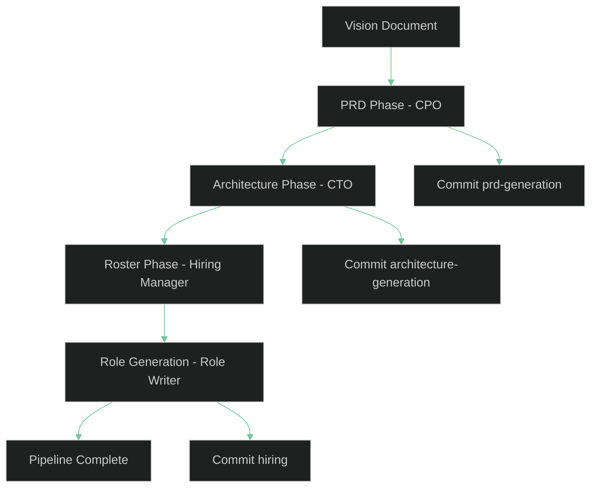
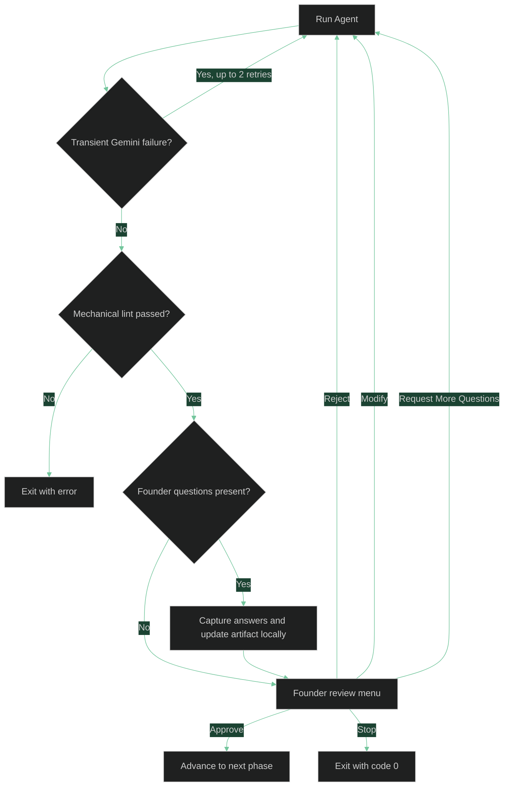

# Key Concepts

This page explains the core ideas behind the V0.2 workflow so you can predict what `asw` will do before you run it.

## The V0.2 Pipeline

`asw start` runs a fixed sequence of phases. Each phase is owned by one agent, produces one or more artifacts, and usually pauses for Founder review before the pipeline moves on.



### Phase A - PRD

The CPO turns the vision document into `prd.md`. The PRD must include required sections such as goals, user stories, acceptance criteria, a system overview diagram, risks, and open questions.

### Phase B - Architecture

The CTO reads the vision and approved PRD, then produces:

- `architecture.json` for the machine-readable system specification.
- `architecture.md` for the human-readable summary and Mermaid diagram.

### Phase C1 - Roster

The Hiring Manager reads `architecture.json` and the available standards files, then proposes:

- `roster.json` with role metadata.
- `roster.md` with a human-readable table for review.

### Phase C2 - Role Generation

After the roster is approved, the Role Writer generates one Markdown role prompt per approved roster entry. These files are written into `.company/roles/` and no extra Founder gate runs for this phase.

## How A Single Phase Runs

All reviewable phases share the same execution pattern.



Two details matter here:

- Only transient Gemini failures are retried automatically.
- Structural lint failures do not trigger an automatic rerun.

## Founder Questions And Review Gates

Agents may include structured `founder_questions` in their output. When that happens, `asw` asks you those questions first and applies the answers locally inside the artifact.

That means answering questions does **not** automatically spend another LLM call. You get to inspect the updated artifact before deciding what to do next.

The review menu supports these actions:

| Choice | Behavior |
|--------|----------|
| Approve | Accept the artifact and continue |
| Reject | Discard the current draft and rerun the phase from its original context |
| Modify | Provide multiline feedback and rerun with those notes included |
| Request More Questions | Ask for another question round focused on unresolved issues |
| Stop | Exit cleanly with code `0` |

For the roster phase, **Modify** has an extra shortcut: if you paste a JSON object directly, `asw` validates it and uses that edited roster without calling the Hiring Manager again.

## Agents, Roles, And Standards

Each agent is driven by a role file in `.company/roles/`. On the first run, `asw` copies the bundled defaults into your workspace so you can edit them later.

| Agent | Role File | Primary Output |
|-------|-----------|----------------|
| CPO | `.company/roles/cpo.md` | `.company/artifacts/prd.md` |
| CTO | `.company/roles/cto.md` | `.company/artifacts/architecture.json` and `architecture.md` |
| Hiring Manager | `.company/roles/hiring_manager.md` | `.company/artifacts/roster.json` and `roster.md` |
| Role Writer | `.company/roles/role_writer.md` | Generated role prompts in `.company/roles/` |

Standards files live in `.company/standards/`. The Hiring Manager assigns standards to each generated role through the `assigned_standards` field in the roster, and the Role Writer incorporates those standards into the generated prompt.

## Mechanical Linting And Retries

Before a phase reaches the Founder Review Gate, `asw` validates the artifact mechanically.

Examples of lint checks:

- PRDs must contain the required Markdown sections.
- Acceptance criteria must use completed checklist items like `- [x]`.
- Mermaid code blocks must be present where required.
- Architecture output must contain valid JSON and Mermaid blocks.
- Roster output must be valid JSON with `hired_agents` entries.
- Generated role files must include the required sections and minimum structure.

If linting fails, `asw` exits. This is intentional: the invalid output already exists, so resubmitting the same run automatically would burn more tokens without any Founder intervention.

Before exiting, `asw` saves the rejected output and validation errors under `.company/artifacts/failed/` so you can inspect the bad artifact without relying on debug logs alone.

Automatic retries are reserved for transient Gemini problems such as timeouts, rate limits, busy responses, or temporary service failures.

## The `.company/` Directory

`asw` stores shared state in `.company/` inside your working directory.

```text
.company/
  pipeline_state.json
  roles/
  artifacts/
  memory/
  templates/
  standards/
```

What each part does:

- `pipeline_state.json` tracks completed phases and the vision hash used for resume behavior.
- `roles/` contains bundled role files plus generated specialist roles.
- `artifacts/` contains PRD, architecture, roster, and other generated documents.
- `memory/` is reserved for workflow memory documents.
- `templates/` contains reusable output templates.
- `standards/` contains organization-wide rules injected into role prompts.

If you have an older `.company/state/` directory from earlier runs, `asw` migrates it to `.company/memory/` automatically.

## Git Commits

When commits are enabled, `asw` stages `.company/` by default. If you pass `--stage-all`, it stages the full git worktree before creating the phase commit. Successful runs typically create these commits:

```text
[asw] Phase: prd-generation completed
[asw] Phase: architecture-generation completed
[asw] Phase: hiring completed
```

If there is nothing new to commit for a phase, `asw` prints a message and continues.

Pass `--no-commit` to skip all git operations and the git-repository requirement.

Pass `--stage-all` when you explicitly want the phase commits to include changes outside `.company/`.

## Resume, Restart, And Debug Logs

Rerunning `asw start` usually resumes from saved state rather than starting over.

- PRD, architecture, and roster are skipped only when their expected artifacts still exist.
- Role generation is skipped only when the generated role files expected by the approved roster still exist.
- If the vision file changed, `asw` asks whether to continue or restart.
- `--restart` forces a clean rebuild of `.company/`.
- `--debug` writes detailed logs to a file for troubleshooting. If you pass a custom log path, its parent directory must already exist.

See [Runs, State, and Recovery](runs-and-state.md) for the full behavior.

## LLM Backend

`asw` currently supports one backend: the Google Gemini CLI. There is no user-facing flag to switch backends in V0.2.

## See Also

- [CLI Reference](cli.md) - all commands and flags
- [Runs, State, and Recovery](runs-and-state.md) - resume, restart, and debug behavior
- [Quickstart](../getting-started/quickstart.md) - a practical first run
