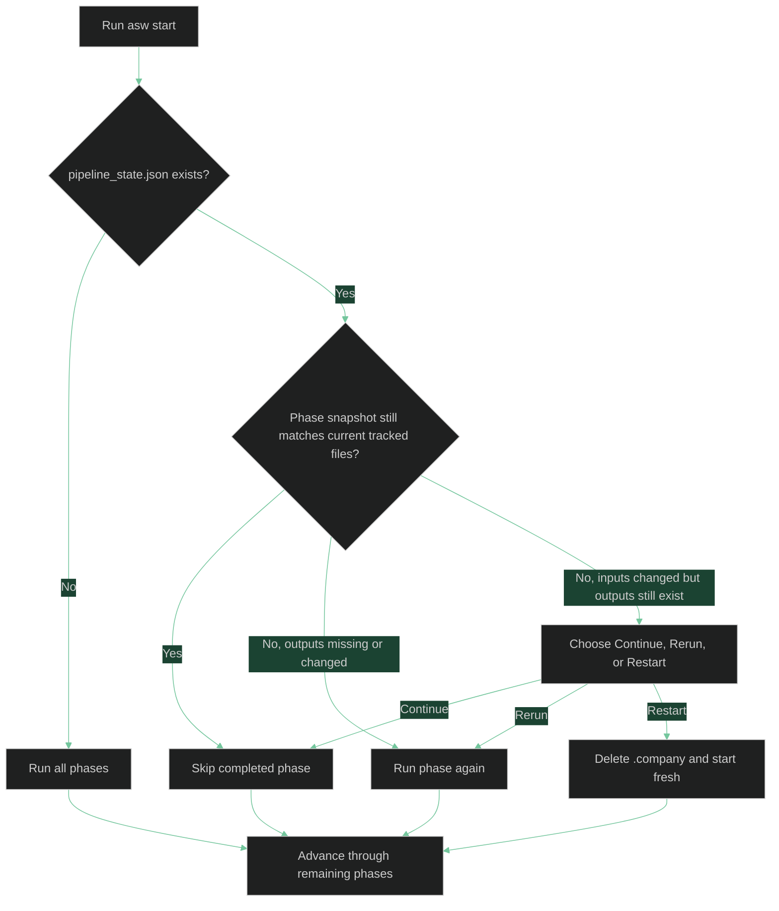

# Runs, State, and Recovery

This reference explains how `asw` resumes runs, reacts to changed tracked inputs, and helps you recover from failures or stale artifacts.

## What `asw` Stores Between Runs

Every run uses a `.company/` directory inside your working directory. One file in that directory controls resume behavior:

```text
.company/
  pipeline_state.json
```

`pipeline_state.json` records:

- The pipeline version.
- A tracked-file hash catalog keyed by file path.
- Per-phase snapshots with `completed_at`, saved input hashes, and saved output hashes.

`asw` compares those saved hashes with the current files before deciding whether to skip, prompt, or rerun a phase.

## How Resume Works

When you rerun the same command, `asw` does not blindly start over. It compares the saved phase snapshots with the current hashes of the tracked files used by each phase.



In practice this means:

- If a completed phase's saved inputs and outputs still match the current tracked files, that phase can be skipped.
- If a completed phase's outputs are missing or changed, `asw` reruns that phase and the phases after it.
- If a completed phase's tracked inputs changed but its outputs still exist, `asw` prompts at the earliest affected phase.
- Resume works even when you used `--no-commit`; saved state is separate from git.

## What Happens When Tracked Inputs Change

The vision file is one tracked input, but it is no longer special-cased. `asw` handles vision changes the same way it handles changes to bundled role files, templates, standards, or saved upstream artifacts.

When tracked inputs changed for a completed phase and the saved outputs still exist, `asw` prompts you with three choices:

- **Continue** uses the saved artifacts as-is for this run.
- **Rerun** invalidates that phase and everything downstream.
- **Restart** deletes `.company/` and starts fresh.

Use **Continue** when your edit is small and the existing artifacts are still acceptable.

Use **Restart** when the product scope, target users, technical assumptions, or execution plan changed enough that the saved PRD or architecture is no longer trustworthy.

## Force A Clean Restart

Use `--restart` when you know the existing `.company/` directory should be discarded:

```bash
asw start --vision vision.md --restart
```

This deletes `.company/` before the run starts and then rebuilds it from the bundled roles, templates, and standards.

Common reasons to use `--restart`:

- You want a completely fresh PRD and architecture.
- You want a fresh execution plan and first-phase team recommendation.
- You significantly rewrote the vision file.
- You manually edited artifacts and want to discard those edits.
- You suspect saved state and on-disk artifacts are out of sync.

## Continue After A Partial Run

If you stop at a Founder Review Gate or the run exits partway through, rerun the same command:

```bash
asw start --vision vision.md
```

`asw` resumes from the first incomplete phase that still needs work.

Examples:

- If PRD and architecture were already approved, the rerun starts at the execution-plan phase.
- If `execution_plan.json` was deleted after a previous run, the execution-plan phase runs again.
- If `execution_plan_template.md` changed after a previous run, `asw` prompts at the execution-plan phase instead of silently skipping it.
- If a standards file or `role_template.md` changed after a previous run, `asw` prompts at the earliest affected downstream phase instead of requiring you to remove artifacts by hand.
- If all tracked inputs and outputs still match, the rerun quickly skips everything.

## Create Debug Logs

Use `--debug` to capture detailed logs from the CLI, orchestrator, and backend.

Create a timestamped log file in the current directory:

```bash
asw start --vision vision.md --debug
```

Write logs to an explicit path:

```bash
asw start --vision vision.md --debug asw.log
```

If you want to use a nested path such as `logs/asw.log`, `asw` creates the parent directory for you.

Debug logs are useful when:

- Gemini retries due to timeouts, rate limits, or other transient failures.
- A generated artifact fails mechanical linting.
- You want a record of the raw artifact text and phase transitions.

The debug log now keeps one canonical combined prompt entry per Gemini invocation rather than repeating the same role and prompt content across multiple logging layers.

If you omit the log path, `asw` creates a file named like `asw-debug-YYYYMMDD-HHMMSS.log` in the directory where you ran the command.

## Recovery Tips

- If a run fails on a missing git repository, either initialize git or rerun with `--no-commit`.
- If a generated artifact is structurally invalid, inspect the saved file under `.company/artifacts/failed/`, then update the vision or your custom role/template files and rerun.
- If the prompt reports changed tracked inputs, rerun from the earliest affected phase unless you intentionally want to continue with stale artifacts.
- If the saved artifacts look stale after major edits, use `--restart` instead of trying to repair the state manually.
- If you need to inspect what happened before the failure, rerun with `--debug` and keep the log file.

## See Also

- [CLI Reference](cli.md) - command syntax, flags, and exit codes
- [Key Concepts](concepts.md) - pipeline phases, review gates, and `.company/`
- [Quickstart](../getting-started/quickstart.md) - a practical first run
