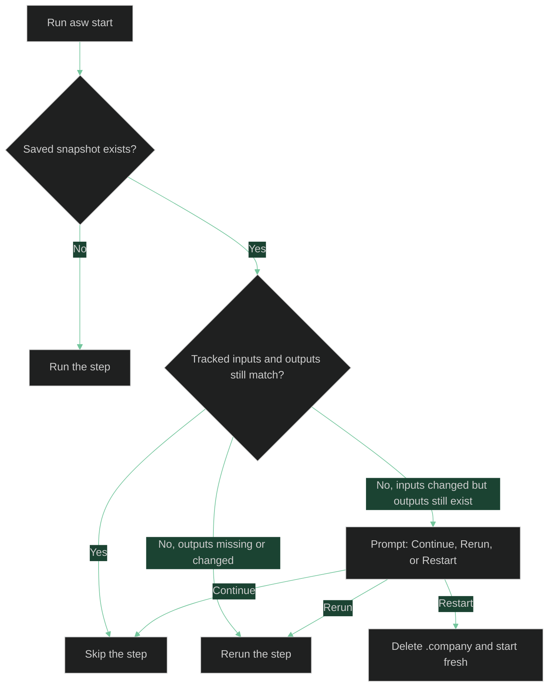

# Runs, State, and Recovery

Understand how `asw` resumes work, what invalidates saved artifacts, and where to inspect failures when a run stops.

## What `asw` Stores Between Runs

Every run uses a `.company/` directory inside your working directory. The main resume file is:

```text
.company/
  pipeline_state.json
```

`pipeline_state.json` records:

- A tracked-file hash catalog keyed by path
- Per-step snapshots with `completed_at`, input hashes, and output hashes
- Metadata for guarded or multi-attempt steps such as approved paths, review decisions, and attempt logs

Related persisted artifacts also matter for recovery:

- `.company/artifacts/validation_contract.json`
- `.company/artifacts/validation_contract.md`
- `.company/artifacts/phases/`
- `.company/artifacts/failed/`

## What Counts As A Tracked Input

Tracked inputs are broader than just the vision file. Depending on the step, `asw` watches files such as:

- The vision document
- Approved upstream artifacts like `prd.md`, `architecture.json`, and `execution_plan.json`
- Role files under `.company/roles/`
- Templates under `.company/templates/`
- Standards under `.company/standards/`
- The validation contract JSON file
- Final phase-design and task-mapping artifacts
- DevOps proposal and setup-script files

That means editing a role prompt, template, standards file, validation contract, or saved phase artifact can invalidate later work even if the vision itself did not change.

## How Resume Works

When you rerun the same command, `asw` compares the current tracked files against the saved hashes before deciding whether to skip, prompt, or rerun.



In practice:

- Matching snapshots are skipped.
- Missing or changed outputs force a rerun.
- Changed inputs with saved outputs trigger a prompt at the earliest affected step.
- Resume works even with `--no-commit`; state tracking is separate from git.

## Granular Resume For Phase Preparation And Implementation

The current branch tracks more than the top-level planning phases.

### Phase-Preparation Steps

For each execution-plan phase, `asw` separately tracks:

- The design step
- The DevOps proposal step
- The DevOps execution step

If the final phase design changes, the downstream proposal and execution markers are cleared so later steps rerun from the right point.

### Implementation Turns

For each owner turn, `asw` tracks these steps independently:

- `plan`
- `execute`
- `validate`
- `review`
- `commit`

This enables mid-turn resume. For example:

- If the plan exists but the execute artifact is missing, `asw` resumes from execute.
- If the validation report is missing, `asw` resumes from validate.
- If review approved the turn and validation passed, but commit did not happen yet, `asw` can resume from commit.

Changing `validation_contract.json` is especially important because it is a tracked input for phase design and implementation turns. Editing it can invalidate the current turn and downstream turns.

## Continue, Rerun, Or Restart

When tracked inputs changed but saved outputs still exist, `asw` prompts with three choices:

- **Continue** uses the saved artifacts as-is for this run.
- **Rerun** invalidates the affected step and everything downstream.
- **Restart** deletes `.company/` and starts fresh.

Use **Continue** only when the saved artifacts are still acceptable despite the change.

Use **Rerun** when you changed something that should affect the generated output.

Use **Restart** when you want a clean slate instead of step-by-step invalidation.

## Deferred Versus Executed Setup Steps

Without `--execute-phase-setups`, the DevOps execution step is recorded as deferred. The proposal, summary, and script remain on disk, but the script is not run.

That deferred state is still tracked. On later runs, `asw` can skip it if the proposal inputs still match.

With `--execute-phase-setups`, the setup script becomes a real guarded execution step:

- Founder approval is required before the script runs.
- Attempt logs are written under `.company/artifacts/phases/`.
- If the script mutates tracked repository files outside the approved boundary, `asw` stops.
- If the proposal or script changes later, approval must happen again.

## Force A Clean Restart

Use `--restart` when you know the existing `.company/` directory should be discarded:

```bash
asw start --vision vision.md --restart
```

This deletes `.company/` before the run starts and rebuilds it from the bundled roles, templates, and standards.

Common reasons to use `--restart`:

- You significantly rewrote the vision.
- You want a fresh PRD, architecture, and execution plan.
- You manually edited artifacts and want to discard those edits.
- You suspect the saved state no longer reflects the on-disk artifacts.

## Continue After A Partial Run

If you stop at a founder gate or the run exits partway through, rerun the same command:

```bash
asw start --vision vision.md
```

Typical outcomes:

- If PRD and architecture are already current, the run resumes at execution plan.
- If a phase-preparation artifact changed, `asw` prompts at the earliest affected phase step.
- If an implementation-turn artifact is missing, `asw` resumes from the missing turn step instead of starting the whole turn over.
- If all tracked inputs and outputs still match, the rerun skips quickly to completion.

## Create Debug Logs

Use `--debug` to capture detailed logs from the CLI, orchestrator, and LLM backend.

Create a timestamped log file in the current directory:

```bash
asw start --vision vision.md --debug
```

Write logs to an explicit path:

```bash
asw start --vision vision.md --debug logs/asw.log
```

`asw` creates missing parent directories for the custom path automatically.

Debug logs are most useful when:

- Gemini retries due to transient failures
- A generated artifact fails structural validation
- A setup script execution fails
- An implementation turn stops after validation or review feedback

## Recovery Patterns

- If the run fails because the working directory is not a git repository, initialize git or rerun with `--no-commit`.
- If an artifact is structurally invalid, inspect `.company/artifacts/failed/` and then rerun after fixing the prompt inputs.
- If a setup execution failed, inspect the latest `*_setup_attempt_*.log` file under `.company/artifacts/phases/`.
- If an implementation turn stopped, inspect the latest `*_validation.md`, `*_scope.md`, and `*_review.md` files under `.company/artifacts/phases/`.
- If commit failed because unapproved changed paths appeared before the turn commit, either clean up the worktree or rerun with a configuration that matches your intended staging behavior.
- If the saved work looks stale after major edits, prefer `--restart` over manual surgery on `pipeline_state.json`.

## See Also

- [CLI Reference](cli.md) - command syntax, flags, and exit codes
- [Key Concepts](concepts.md) - the model behind the tracked phases and loops
- [Quickstart](../getting-started/quickstart.md) - a practical first run
