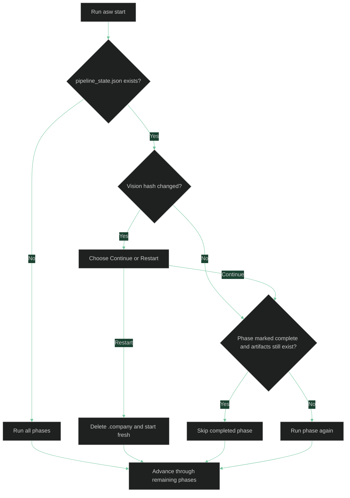

# Runs, State, and Recovery

This reference explains how `asw` resumes runs, reacts to changed vision files, and helps you recover from failures or stale artifacts.

## What `asw` Stores Between Runs

Every run uses a `.company/` directory inside your working directory. One file in that directory controls resume behavior:

```text
.company/
  pipeline_state.json
```

`pipeline_state.json` records:

- The pipeline version.
- A SHA-256 hash of the vision file used for the last run.
- Which phases completed successfully.

`asw` checks that saved state against the artifacts on disk before deciding whether to skip or rerun a phase.

## How Resume Works

When you rerun the same command, `asw` does not blindly start over. It compares saved state, the current vision file, and the expected artifact files.



In practice this means:

- If PRD, architecture, and roster artifacts still exist, those completed phases can be skipped on a later run.
- For PRD, architecture, and roster, if a phase is marked complete but one of its required artifacts is missing, `asw` reruns that phase and the phases after it.
- Role generation is currently resumed from saved phase state rather than per-file checks for generated role files.
- Resume works even when you used `--no-commit`; saved state is separate from git.

## What Happens When The Vision Changes

If the vision file contents change after a previous run, `asw` detects the new hash and asks whether to continue from the saved state or restart from scratch.

Use **Continue** when your edit is small and the existing artifacts are still acceptable.

Use **Restart** when the product scope, target users, technical assumptions, or hiring plan changed enough that the saved PRD or architecture is no longer trustworthy.

## Force A Clean Restart

Use `--restart` when you know the existing `.company/` directory should be discarded:

```bash
asw start --vision vision.md --restart
```

This deletes `.company/` before the run starts and then rebuilds it from the bundled roles, templates, and standards.

Common reasons to use `--restart`:

- You want a completely fresh PRD and architecture.
- You significantly rewrote the vision file.
- You manually edited artifacts and want to discard those edits.
- You suspect saved state and on-disk artifacts are out of sync.

## Continue After A Partial Run

If you stop at a Founder Review Gate or the run exits partway through, rerun the same command:

```bash
asw start --vision vision.md
```

`asw` resumes from the first incomplete phase that still needs work.

Examples:

- If PRD and architecture were already approved, the rerun starts at the roster phase.
- If `roster.json` was deleted after a previous run, the roster phase runs again.
- If all reviewable artifacts still exist and role generation is already marked complete, the rerun quickly skips everything.

## Create Debug Logs

Use `--debug` to capture detailed logs from the CLI, orchestrator, and backend.

Create a timestamped log file in the current directory:

```bash
asw start --vision vision.md --debug
```

Write logs to an explicit path:

```bash
asw start --vision vision.md --debug asw.log
```

If you want to use a nested path such as `logs/asw.log`, create the parent directory first.

Debug logs are useful when:

- Gemini retries due to timeouts, rate limits, or other transient failures.
- A generated artifact fails mechanical linting.
- You want a record of the raw artifact text and phase transitions.

If you omit the log path, `asw` creates a file named like `asw-debug-YYYYMMDD-HHMMSS.log` in the directory where you ran the command.

## Recovery Tips

- If a run fails on a missing git repository, either initialize git or rerun with `--no-commit`.
- If a generated artifact is structurally invalid, update the vision or your custom role/template files and rerun.
- If the saved artifacts look stale after major edits, use `--restart` instead of trying to repair the state manually.
- If you need to inspect what happened before the failure, rerun with `--debug` and keep the log file.

## See Also

- [CLI Reference](cli.md) - command syntax, flags, and exit codes
- [Key Concepts](concepts.md) - pipeline phases, review gates, and `.company/`
- [Quickstart](../getting-started/quickstart.md) - a practical first run
