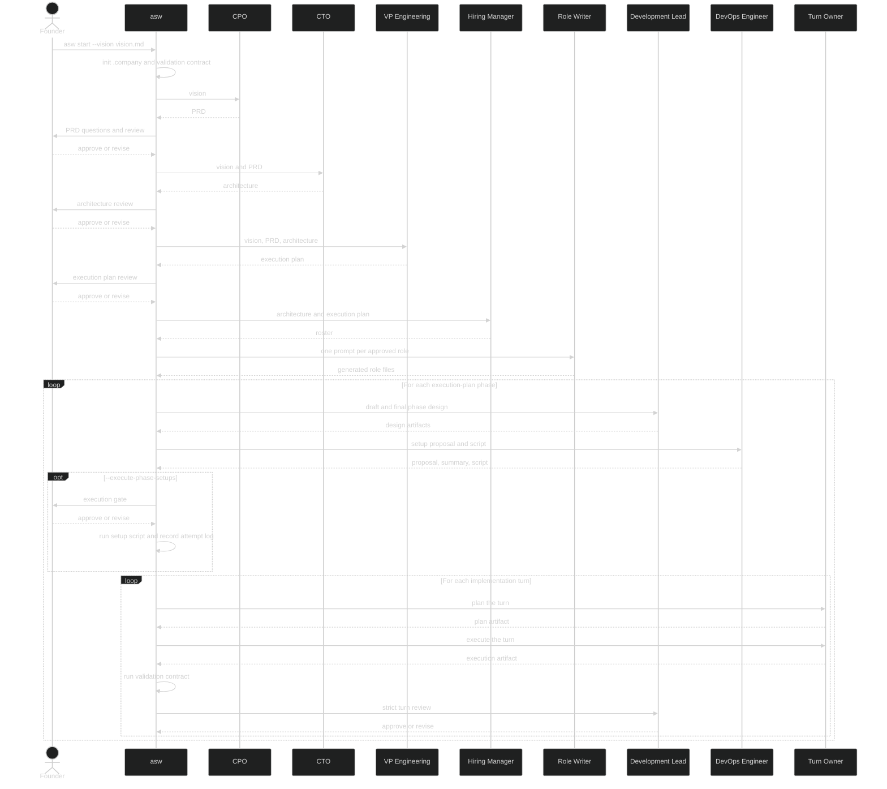

# Tutorial: First Complete Run

Walk through a realistic project from vision to implementation-turn artifacts so you can see how the current pipeline behaves in practice.

## What You Will Learn

- How to write a vision document that drives useful planning artifacts
- How to review the PRD, architecture, and execution-plan gates
- How the validation contract, phase-preparation artifacts, and implementation turns fit together
- How optional setup execution, automatic commits, and reruns behave in a real workspace

Complete [Installation](../getting-started/installation.md) first.

## 1 - Set Up The Project

```bash
mkdir link-vault
cd link-vault
git init
git commit --allow-empty -m "Initial commit"
```

If you do not want git commits yet, you can still follow the tutorial and add `--no-commit` to the run command.

## 2 - Write The Vision Document

Create `vision.md`. Focus on the product behavior, important constraints, and non-goals.

```markdown
# Vision: Link Vault

## Product Overview
A personal web app that lets me save, tag, and search bookmarks from the
browser. I want full-text search across page titles and my own notes,
and the ability to export bookmarks as JSON or Markdown.

## Target Audience
Solo knowledge workers and researchers who outgrow browser bookmarks.

## Core Requirements
- Save a URL with an auto-fetched title, a user note, and one or more tags.
- Full-text search across title, note, and tags.
- Tag-based filtering.
- Export bookmarks as JSON or Markdown.
- Browser extension or bookmarklet for one-click saving.
- Self-hostable with a Docker Compose setup.

## Non-Goals
- Sharing or collaboration features.
- Mobile native apps.

## Definition of Done
A self-hosted web app with acceptance criteria, Docker Compose support,
and unit tests.
```

## 3 - Start The Pipeline

Run the full pipeline with a debug log:

```bash
asw start --vision vision.md --debug link-vault.log
```

The early output looks like this:

```text
========================================================================
  AgenticOrg CLI – V0.3 Pipeline
========================================================================
✓ Vision loaded: vision.md (751 chars)
✓ LLM backend: Gemini CLI

✓ Company directory initialised: /path/to/link-vault/.company
```

The initialization step also bootstraps `.company/artifacts/validation_contract.json` and `.company/artifacts/validation_contract.md`.

## 4 - Review PRD, Architecture, And Execution Plan

These are the three normal founder-review gates in the current pipeline.

Inspect the artifacts as they appear:

```bash
sed -n '1,220p' .company/artifacts/prd.md
cat .company/artifacts/architecture.json
sed -n '1,240p' .company/artifacts/architecture.md
cat .company/artifacts/execution_plan.json
sed -n '1,220p' .company/artifacts/execution_plan.md
```

Good review questions for this project:

- Does the PRD stay focused on a personal product instead of drifting into collaboration features?
- Does the architecture support full-text search, exports, and self-hosting cleanly?
- Does the execution plan keep Phase 1 narrow enough to validate locally before expanding into hosted operations?

When the execution-plan gate needs precise edits, you can paste a full JSON object during **Modify** and let `asw` validate it locally.

## 5 - Inspect The Validation Contract And Hired Team

After execution-plan approval, `asw` generates the roster and role prompts automatically. Inspect the validation contract and the resulting team artifacts:

```bash
sed -n '1,220p' .company/artifacts/validation_contract.md
cat .company/artifacts/roster.json
sed -n '1,220p' .company/artifacts/roster.md
ls .company/roles
```

The validation contract starts as a baseline artifact. By default it documents the current gaps and a change policy, but usually has no active command validations yet.

The roster and generated role prompts should reflect the approved execution plan rather than inventing extra roles.

## 6 - Inspect The Phase-Preparation Outputs

After hiring artifacts are complete, `asw` iterates through each execution-plan phase and prepares the work.

Inspect the first phase artifacts:

```bash
ls .company/artifacts/phases
sed -n '1,220p' .company/artifacts/phases/01_design_draft.md
sed -n '1,220p' .company/artifacts/phases/01_design_final.md
cat .company/artifacts/phases/01_task_mapping.json
sed -n '1,220p' .company/artifacts/phases/01_task_mapping.md
```

You should see a sequence like this for each approved phase:

- A Development Lead draft
- One feedback artifact per assigned role
- A harmonized final design
- A canonical task mapping in both JSON and Markdown
- A DevOps setup proposal and summary
- A generated setup script under `.devcontainer/phase_01_setup.sh`

Inspect the setup files too:

```bash
sed -n '1,220p' .company/artifacts/phases/01_setup_proposal.md
sed -n '1,220p' .company/artifacts/phases/01_setup_summary.md
sed -n '1,220p' .devcontainer/phase_01_setup.sh
```

## 7 - Understand Optional Setup Execution

The default path writes setup proposals and scripts but does not run them. The execution step is recorded as deferred unless you opt in with `--execute-phase-setups`.

If you do opt in:

```bash
asw start --vision vision.md --execute-phase-setups
```

`asw` shows a separate red execution gate before running the generated script. If you approve execution and the script runs, each attempt is logged under `.company/artifacts/phases/` with files like:

- `01_setup_attempt_1.log`

If the script touches tracked repository files outside the approved boundary, `asw` stops instead of silently continuing.

## 8 - Inspect The Implementation Turns

After phase preparation, `asw` executes owner turns from the task mapping. Each turn records plan, execute, validation, scope, review, and commit artifacts.

Inspect the directory first so you can see your actual role names:

```bash
ls .company/artifacts/phases
```

Then inspect the first turn files:

```bash
sed -n '1,220p' .company/artifacts/phases/01_turn_01_*_plan.md
sed -n '1,220p' .company/artifacts/phases/01_turn_01_*_execute.md
sed -n '1,220p' .company/artifacts/phases/01_turn_01_*_validation.md
sed -n '1,220p' .company/artifacts/phases/01_turn_01_*_review.md
```

Important behavior to watch:

- The validation step reruns the current validation contract after execution.
- The Development Lead review compares the changed paths, assigned standards, and validation report against the approved turn scope.
- If validation fails or the review decision is `revise`, `asw` retries the same turn with concrete follow-up guidance.
- If commits are enabled, approved turns create commits with messages like `[asw] Phase: phase_1:turn:1 completed`.

## 9 - Check The Git History

If commits are enabled, inspect the automatic commit trail:

```bash
git log --oneline
```

You should see major planning commits such as:

```text
[asw] Phase: prd-generation completed
[asw] Phase: architecture-generation completed
[asw] Phase: execution-plan-generation completed
[asw] Phase: hiring completed
```

You may also see one commit per approved implementation turn. The exact number depends on the task mapping and whether a turn actually had changes to commit.

## 10 - Rerun Safely After Changes

The easiest way to resume is to run the same command again:

```bash
asw start --vision vision.md
```

Common examples:

```bash
asw start --vision vision.md --restart
```

```bash
asw start --vision vision.md --debug second-run.log
```

Useful expectations:

- If saved inputs and outputs still match, `asw` skips the completed step.
- If outputs are missing or changed, `asw` reruns the step.
- If tracked inputs changed but saved outputs still exist, `asw` prompts you to continue, rerun, or restart.
- Editing `validation_contract.json`, a role file, a template, or a saved phase artifact can invalidate later preparation or implementation steps.

## Diagram: What The Pipeline Did



## What's Next

- [CLI Reference](../reference/cli.md) - see every supported flag in one place
- [Key Concepts](../reference/concepts.md) - learn the pipeline model behind the artifacts you just inspected
- [Runs, State, and Recovery](../reference/runs-and-state.md) - understand what invalidates saved work and how reruns resume
