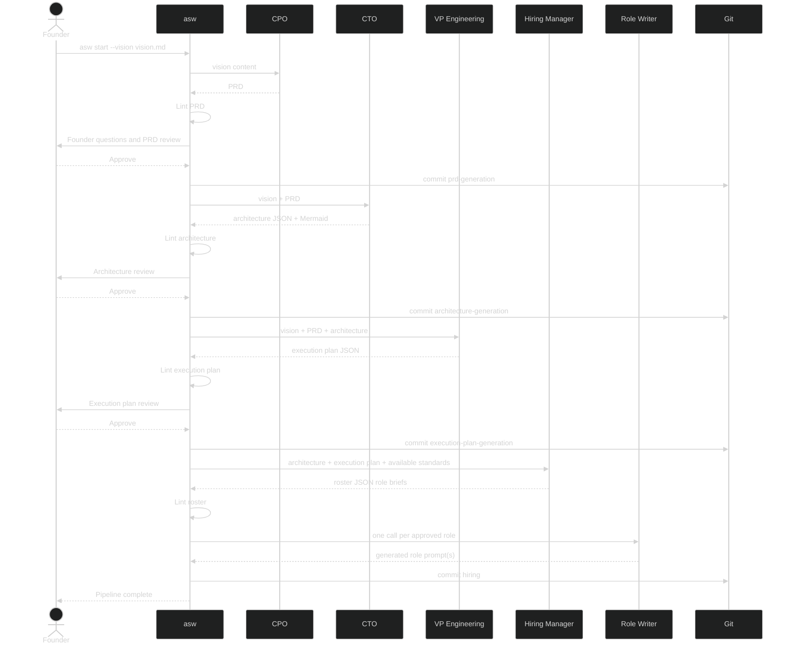

# Tutorial: First Complete Run

This tutorial walks through a realistic V0.2 run so you can evaluate each artifact, handle founder questions, and understand what a finished `.company/` workspace looks like.

**What you will learn:**

- How to write a vision document that produces useful downstream artifacts.
- How to review the PRD, architecture, and execution-plan gates.
- How generated roles inherit responsibilities and standards.
- How reruns, restarts, and debug logs fit into a real workflow.

**Prerequisites:** Complete [Installation](../getting-started/installation.md) first.

## 1 - Set Up The Project

```bash
mkdir link-vault
cd link-vault
git init
git commit --allow-empty -m "Initial commit"
```

If you do not want git commits yet, you can still follow the tutorial and add `--no-commit` to the run command later.

## 2 - Write The Vision Document

Create `vision.md`. Focus on what you want to build, who it is for, and what success looks like. Avoid over-specifying implementation details unless they are real constraints.

```markdown
# Vision: Link Vault

## Product Overview
A personal web app that lets me save, tag, and search bookmarks from the
browser. I want full-text search across page titles and my own notes,
and the ability to export bookmarks as JSON or Markdown.

## Target Audience
Solo knowledge workers and researchers who outgrow browser bookmarks.

## Core Requirements
- Save a URL with an auto-fetched title, a user note, and one or more tags.
- Full-text search across title, note, and tags.
- Tag-based filtering.
- Export bookmarks as JSON or Markdown.
- Browser extension or bookmarklet for one-click saving.
- Self-hostable with a Docker Compose setup.

## Non-Goals
- Sharing or collaboration features.
- Mobile native apps.

## Definition of Done
A self-hosted web app with acceptance criteria, Docker Compose support,
and unit tests.
```

Good vision documents usually do three things well:

- They describe user-facing behavior clearly.
- They name important constraints, such as self-hosting or export formats.
- They include non-goals so the PRD does not sprawl.

## 3 - Start The Pipeline

Run the full pipeline and capture a log while you learn:

```bash
asw start --vision vision.md --debug link-vault.log
```

The early output looks like this:

```text
========================================================================
  AgenticOrg CLI – V0.2 Pipeline
========================================================================
✓ Vision loaded: vision.md (751 chars)
✓ LLM backend: Gemini CLI

✓ Company directory initialised: /path/to/link-vault/.company

>> CPO – attempt 1
   Invoking CPO via Gemini CLI (may take up to 5 min)…
```

Two important rules for the rest of the tutorial:

- `asw` retries only transient Gemini failures, such as timeouts or busy responses.
- If an artifact fails mechanical linting, the run exits instead of auto-resubmitting the same invalid output.

## 4 - Review The PRD Carefully

When the CPO finishes, inspect the artifact:

```bash
sed -n '1,220p' .company/artifacts/prd.md
```

Check these first:

- The product summary should match your intent.
- Functional requirements should include everything in the vision and avoid invented extras.
- Acceptance criteria should be concrete enough to test.
- The Mermaid diagram should reflect the right system shape.

If the PRD contains structured founder questions, `asw` asks them before showing the review menu. Your answers are written into the PRD locally, which lets you inspect the resolved decisions before any rerun happens.

While those questions are pending, the review panel hides the raw structured question payload and the duplicate pending-question prose, so the CLI remains the single place where you answer them.

Choose the review action that matches the situation:

| Situation | Best Choice |
|-----------|-------------|
| The PRD is accurate and complete | Approve |
| The PRD drifted badly from the vision | Reject |
| A few sections need targeted changes | Modify |
| The PRD still has unresolved unknowns | Request More Questions |
| You want to stop and rethink the project | Stop |

Example modify feedback:

```text
Remove all references to team collaboration in V1. The vision is for a
personal tool. In the diagram, the browser extension should talk to the
API, not directly to the database.
```

In the multiline feedback prompt, press `Esc`, then `Enter`, to submit.

## 5 - Review The Architecture

After PRD approval, the CTO generates `architecture.json` and `architecture.md`.

Inspect both:

```bash
cat .company/artifacts/architecture.json
sed -n '1,240p' .company/artifacts/architecture.md
```

Look for alignment between the vision, PRD, and technical choices:

- Is the tech stack appropriate for a self-hosted bookmark app?
- Do the components map cleanly to the browser extension, API, search, and storage needs?
- Do the data models contain the fields you would expect for bookmarks, notes, and tags?
- Do the API contracts support the user-facing behaviors from the vision?

If the architecture raises deployment or stack questions, **Request More Questions** is often better than making the CTO guess.

## 6 - Review The Execution Plan

After architecture approval, the VP Engineering proposes the phased delivery plan and initial team in:

```bash
cat .company/artifacts/execution_plan.json
sed -n '1,220p' .company/artifacts/execution_plan.md
```

This is the phase where you control scope, headcount, and sequencing.

Review the execution plan for:

- A Phase 1 scope that is still too ambitious.
- Roles that were hired too early instead of deferred.
- Missing rationale for why a role is needed now.
- Deferred capabilities that should actually move forward sooner.

You have two useful modify strategies:

- Write natural-language feedback if you want the VP Engineering to rethink the phased plan or the selected team.
- Paste an edited JSON object if you already know the exact team and sequencing you want. `asw` validates that JSON before accepting it.

For example, if the proposed plan adds dedicated DevOps work too early, you might defer that capability and keep the first phase focused on local validation.

## 7 - Inspect The Role Briefs And Generated Roles

After execution-plan approval, the Hiring Manager automatically elaborates the approved team into structured role briefs:

```bash
cat .company/artifacts/roster.json
sed -n '1,220p' .company/artifacts/roster.md
```

At this point, the team is already decided. The Hiring Manager is refining mission, scope, deliverables, collaborators, and standards for each approved role.

After that, `asw` generates one role prompt per approved entry. Inspect the results:

```bash
ls .company/roles
sed -n '1,220p' .company/roles/python_backend_developer.md
```

Generated role files should feel specific, not generic. Each one should:

- Reference real parts of the architecture.
- Describe exactly what the role produces.
- Enforce any assigned standards.

The bundled standards also remain editable for future runs:

```bash
ls .company/standards
sed -n '1,200p' .company/standards/python_guidelines.md
```

`asw` also copies bundled templates into `.company/templates/`. In the current
pipeline, the live ones are `execution_plan_template.md` for the VP
Engineering phase and `role_template.md` for specialist role generation.

Inspect them with:

```bash
ls .company/templates
sed -n '1,220p' .company/templates/execution_plan_template.md
sed -n '1,220p' .company/templates/role_template.md
```

If you edit templates, standards, bundled role files, or the vision after a completed run, the next `asw start --vision vision.md` compares those tracked files against the saved phase snapshots in `.company/pipeline_state.json` and prompts at the earliest affected phase.

## 8 - Understand The Finished Workspace

After a successful run, you should have a structure like this:

```text
link-vault/
  vision.md
  .company/
    pipeline_state.json
    roles/
      cpo.md
      cto.md
      vpe.md
      hiring_manager.md
      role_writer.md
      python_backend_developer.md
    artifacts/
      prd.md
      architecture.json
      architecture.md
      execution_plan.json
      execution_plan.md
      roster.json
      roster.md
    memory/
    templates/
    standards/
```

If commits are enabled, your git log will usually contain four `asw` commits:

```bash
git log --oneline
```

```text
a1b2c3d [asw] Phase: hiring completed
4d5e6f7 [asw] Phase: execution-plan-generation completed
7e8f9a0 [asw] Phase: architecture-generation completed
1234567 [asw] Phase: prd-generation completed
```

## 9 - Rerun Safely After Changes

The easiest way to resume is to run the same command again:

```bash
asw start --vision vision.md
```

Useful expectations:

- If the saved input and output hashes still match, completed phases are skipped.
- If tracked inputs changed but the saved outputs still exist, `asw` asks whether to continue, rerun from that phase, or restart.
- If you want a guaranteed clean slate, use `--restart`.

Examples:

```bash
asw start --vision vision.md --restart
```

```bash
asw start --vision vision.md --debug second-run.log
```

## Diagram: What The Pipeline Did



## What's Next

- [CLI Reference](../reference/cli.md) - all flags in one place
- [Runs, State, and Recovery](../reference/runs-and-state.md) - resume, restart, and debug behavior
- [Key Concepts](../reference/concepts.md) - deeper explanation of phases, gates, and generated roles
