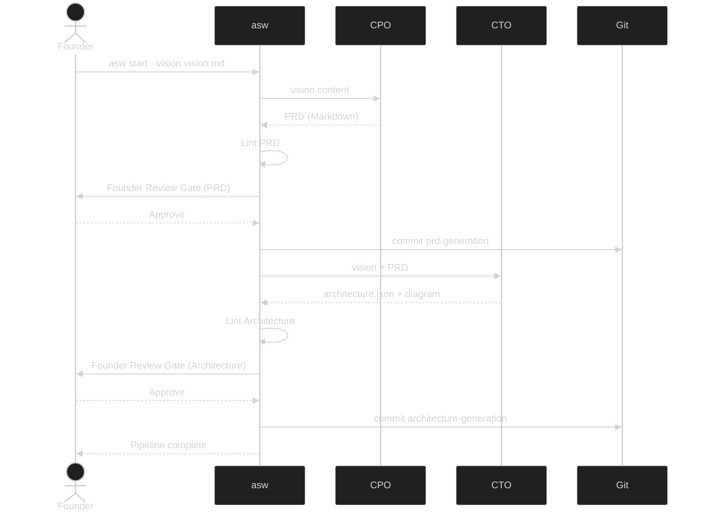

# Tutorial: From Idea to Architecture

In this tutorial you will run `asw` end to end on a real project idea and learn what to do at each Founder Review Gate. By the end you will have a git-committed PRD and system architecture ready to hand to the next stage of your SDLC.

**What you will learn:**

- How to write a vision document that produces good agent output
- How to evaluate the PRD and architecture artifacts
- When to Approve, Reject, or Modify

**Prerequisites:** Complete [Installation](../getting-started/installation.md) first.

---

## 1 — Set Up the Project

```bash
mkdir link-vault
cd link-vault
git init
git commit --allow-empty -m "Initial commit"
```

---

## 2 — Write the Vision Document

Create `vision.md`. Think of this as a two-minute pitch to a competent founding team — focus on *what* you want to build and *for whom*, not *how*.

```markdown
# Vision: Link Vault

## Product Overview
A personal web app that lets me save, tag, and search bookmarks from the
browser. I want full-text search across page titles and my own notes,
and the ability to export bookmarks as JSON or Markdown.

## Target Audience
Solo knowledge workers and researchers who outgrow browser bookmarks.

## Core Requirements
- Save a URL with an auto-fetched title, a user note, and one or more tags.
- Full-text search across title, note, and tags.
- Tag-based filtering.
- Export bookmarks as JSON or Markdown.
- Browser extension or bookmarklet for one-click saving.
- Self-hostable with a Docker Compose setup.

## Non-Goals (V1)
- Sharing or collaboration features.
- Mobile native apps.

## Definition of Done
A self-hosted web app that passes acceptance criteria, with Docker Compose
and unit tests.
```

**Tips for a strong vision document:**

- Be specific about user-facing behaviours (saves, searches, exports) rather than implementation details.
- Include a "Non-Goals" section — it prevents the CPO agent from over-scoping.
- A short Definition of Done keeps the PRD focused.

---

## 3 — Start the Pipeline

```bash
asw start --vision vision.md
```

You will see live progress in the terminal:

```text
========================================================================
  AgenticOrg CLI – V0.1 Pipeline
========================================================================

✓ Company directory initialised: /path/to/link-vault/.company
✓ Vision loaded: vision.md (751 chars)
✓ LLM backend: Gemini CLI

>> CPO – attempt 1
   Lint passed for PRD.

✓ PRD written: .company/artifacts/prd.md
```

If the CPO agent produces a structurally invalid PRD, you will see lint errors and the agent will automatically retry (up to two more times) with feedback. If all retries fail, the pipeline exits — rewrite your vision and try again.

---

## 4 — Review the PRD

The pipeline pauses at the first Founder Review Gate and prints a preview of the PRD.

Open the full document in another terminal to read it properly:

```bash
cat .company/artifacts/prd.md
```

Or in VS Code:

```bash
code .company/artifacts/prd.md
```

**What to look for:**

- **Executive Summary** — does it correctly describe your product?
- **Functional Requirements** — are all your core requirements captured? Are there any invented requirements you do not want?
- **User Stories** — do they reflect real user goals?
- **System Overview Diagram** — does the Mermaid diagram match your mental model of the system?
- **Open Questions** — are there genuine unknowns worth addressing?

### Decision Guide

| Situation | Best Choice |
|-----------|-------------|
| The PRD accurately reflects your vision | `A` — Approve |
| The PRD hallucinated features you did not ask for | `R` — Reject (agent starts clean) |
| One or two sections need adjustment | `M` — Modify, then write targeted feedback |
| You want to rethink the vision entirely | `S` — Stop, revise `vision.md`, re-run |

**Example Modify feedback** (enter after pressing `M`):

```text
Remove all references to a mobile app. The Non-Goals section clearly
excludes mobile native apps. Also, the System Overview Diagram should
show the browser extension connecting to the API, not directly to the
database.
```

Press **Enter on a blank line** to submit.

---

## 5 — After PRD Approval

Once you approve, `asw` commits the PRD:

```text
✓ Company directory initialised: ...
  (no changes to commit for phase 'prd-generation')
```

> If your git index already had these files, `asw` notes there is nothing new to commit — that is fine.

The CTO agent then runs immediately:

```text
>> CTO – attempt 1
   Lint passed for Architecture.

✓ Architecture JSON written: .company/artifacts/architecture.json
✓ Architecture diagram written: .company/artifacts/architecture.md
```

---

## 6 — Review the Architecture

Open the artifacts:

```bash
cat .company/artifacts/architecture.json
cat .company/artifacts/architecture.md
```

The JSON spec covers: `project_name`, `tech_stack`, `components`, `data_models`, `api_contracts`, and `deployment`. The Markdown file contains a Mermaid component diagram.

**What to look for:**

- **Tech Stack** — is the chosen language and framework reasonable for your project?
- **Components** — are the major building blocks sensible (e.g. API server, database, browser extension)?
- **Data Models** — do the fields match what you described in the vision?
- **API Contracts** — are the endpoints the right level of granularity?
- **Deployment** — does the platform and strategy match "self-hostable with Docker Compose"?

Use the same `A / R / M / S` decision guide as the PRD gate.

---

## 7 — Final State

After both gates are approved your project contains:

```text
link-vault/
  vision.md
  .company/
    roles/
      cpo.md
      cto.md
    artifacts/
      prd.md
      architecture.json
      architecture.md
```

And your git log has two auto-commits:

```bash
git log --oneline
```

```text
a1b2c3d [asw] Phase: architecture-generation completed
7e8f9a0 [asw] Phase: prd-generation completed
1234567 Initial commit
```

---

## Diagram: What the Pipeline Did



---

## What's Next

- [CLI Reference](../reference/cli.md) — all flags in one place
- [Key Concepts](../reference/concepts.md) — deeper explanation of every moving part
- Edit `.company/roles/cpo.md` or `.company/roles/cto.md` to customise agent behaviour for your project
